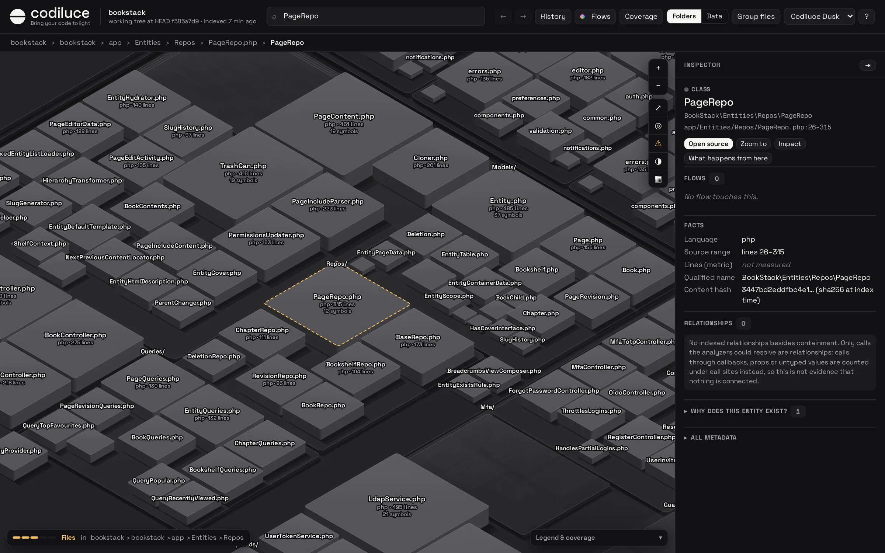
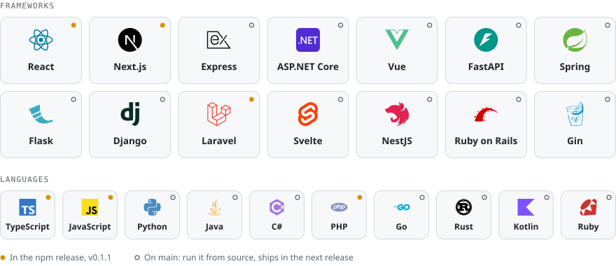

<p align="center">
  <a href="https://codiluce.com">
    <picture>
      <source media="(prefers-color-scheme: dark)" srcset="docs/brand/logo-on-dark.svg">
      
    </picture>
  </a>
</p>

<p align="center">
  <strong>Bring your code to light.</strong><br>
  See how your code fits together, even as agents keep changing it.
</p>

<p align="center">
  <a href="https://www.npmjs.com/package/codiluce"></a>
  <a href="LICENSE"></a>
  
</p>

<p align="center">
  <a href="https://codiluce.com">Website</a> ·
  <a href="https://codiluce.com/docs/">Docs</a> ·
  <a href="#contributing">Contributing</a>
</p>



## Why Codiluce?

<picture>
  <source media="(prefers-color-scheme: dark)" srcset="docs/readme/comprehension-gap-on-dark.svg">
  
</picture>

**The comprehension gap is widening.** More people and more agents are writing code, and every change is bigger than
the last. Reading the diff no longer tells a team what the system does, which flows a change touches, or what it can
break.

Codiluce keeps understanding in step with the code. It reads your repository and draws it as a map you can zoom,
search and replay, where every link between pages, requests, functions and tables comes with the evidence behind it.

## Quick start

Run it inside the repository you want to see:

```bash
npx codiluce@latest start .
```

Codiluce indexes the code, starts a local server and opens the map in your browser. You need Node.js 22.12 or newer.
Add `.codiluce/` to your `.gitignore`: that is where the analysis lives.

Want it always at hand? Run `npm install --global codiluce`, then `codiluce start .` in any repository.

## What you can do

- **Zoom from the whole repository to a single line.** Applications, folders, files and symbols nest inside each other,
  sized by their code.
- **Follow a flow end to end.** From a page or a command, through the request, to the handler and the tables it reads
  and writes.
- **Replay your Git history.** Every commit becomes a snapshot. Compare any two, or watch the architecture change as a
  time-lapse.
- **See the blast radius.** Pick anything and see what depends on it, hop by hop.
- **Check the evidence.** Every link opens the file and line that proves it. What cannot be proven shows up as a
  finding, never as a guess.
- **Add descriptions, if you like.** A language model can describe files, flows and commits, with the cost estimated
  and capped first.

## Private by design

Codiluce runs on your machine. It reads your code but never runs it, never installs its dependencies and never writes
to your checkout. Nothing leaves your computer unless you ask for AI descriptions or GitHub pull request data.

## Languages and frameworks

<picture>
  <source media="(prefers-color-scheme: dark)" srcset="docs/readme/stacks-on-dark.svg">
  
</picture>

How far Codiluce follows the code depends on the stack:

- **Flows to the data:** React and Next.js with Laravel and Inertia, from the click through the request to the
  handler and the tables it reads and writes.
- **Routes and handlers:** Express, NestJS, Vue Router, Nuxt, SvelteKit and Astro; Django, FastAPI and Flask; Spring
  MVC and WebFlux; ASP.NET Core; Ruby on Rails; Gin, Echo, Fiber, Chi, Gorilla Mux and net/http; Axum, Actix Web,
  Rocket and Warp. Every route links to the exact handler that serves it.
- **Structure:** TypeScript, JavaScript, PHP, Python, Go, Ruby, Java, Kotlin, C# and Rust get declarations, imports,
  references and direct calls.
- **Map:** Angular, Remix, Fastify, Symfony, Quarkus, Blazor and every other language and framework are detected and
  mapped with their files, lines and Git metrics.

The npm release (0.1.1) analyzes TypeScript, JavaScript, React, Next.js, Laravel and Inertia. Everything else is on
`main`: [run it from source](CONTRIBUTING.md#develop-locally) today, and it ships in the next release. See what each
framework covers, and what stays a visible gap, in [Languages & frameworks](https://codiluce.com/docs/stacks/).

<sub>Logos are trademarks of their owners, shown only to say which code Codiluce reads. Artwork from
[Simple Icons](https://simpleicons.org) (CC0) and [Devicon](https://devicon.dev) (MIT).</sub>

<details>
<summary>Analysis notes by language, for contributors</summary>

TypeScript and JavaScript are analyzed down to calls and requests across applications and local workspace packages, and supported frameworks down to
routes, commands and tables. Express and Nest have static routing packs for mounted routers and registered controllers,
with handler links and visible gaps. Python, Go, Ruby, Rust, Java, C# and Kotlin also have declaration maps, with source ranges
and nested types/functions. Python also resolves static imports across packages, namespace portions and configured or
manifest source roots, binds local/imported calls and bounded re-exports, and has initial FastAPI, Flask and Django packs for
registered routes, routers/blueprints, URL includes/namespaces, invoked or configured entrypoints, exact function/class view handlers and framework references. Conditional/type-only bindings and dynamic
registration retain visible gaps. The inspector shows which analysis features are available for each file. Other ecosystems
are detected and mapped with their files, lines and Git metrics. Missing
yours? [Tell us](https://github.com/codiluce/codiluce/issues).

Java and Kotlin now resolve original local import declarations within selected Maven reactors, literal Gradle projects
and recorded source/classpath inputs. Explicit, wildcard, static and alias imports retain source evidence and visibility
constraints. Unknown build configuration, excluded sources, binary classpaths and competing declarations stay visible.
Scoped Java/Kotlin references now bind original types and exact signatures for direct static/private/final/concrete calls,
with separate original lambda ownership. Virtual/inherited/generic dispatch, generated constructors and injection retain gaps.
The initial Spring MVC pack supports selected Spring 6.2/7.0 and Boot 3.5/4.0 profiles, resolved controller/mapping annotations,
class/method path arrays, original constant paths, recorded or entry-configuration component scans, direct original handlers,
literal servlet prefixes and bounded PathPattern matching. Parameter restrictions and HTTP HEAD/OPTIONS remain distinct;
unknown headers, negotiation, profiles, custom configuration and registrations stay constrained. Plain Spring is detected
alongside Boot. The initial WebFlux.fn pack adds Java builder chains, Kotlin `router`/`coRouter`, nested/composed routes,
original functional handlers and first-match dispatch under selected reactive profiles and bean registrations.
`jvm.spring.stack: webflux` with `componentScan` or `routers` records a deployment selection; `entrypoints.spring` can
select original Boot or Configuration/EnableWebFlux roots. Unknown predicates, filters, bean ordering and custom
configuration remain visible candidates. No target JVM compiler, build, dependency, plugin or application runs.
C# now resolves original namespace, static, alias and global using directives within indexed SDK/MSBuild compile items,
linked source files and local project references. Literal props/targets imports, recorded target/configuration selections
and original XML `Using` items retain source evidence. Compatible partial types combine member lookup while retaining every
original fragment and compilation identity. Scoped references, exact overloads, direct nonvirtual/concrete calls, original
lambdas, local functions and top-level bodies now retain source proof and call coverage. Overlapping compilations,
conflicting partial declarations, conditional preprocessing, denied sources and executable build behavior remain explicit. `applications[].dotnet` records the selected
project and compilation inputs; `sourceRoots.csharp` can define a compilation when no project is available.
Inherited/generic/dynamic dispatch, conversions, generated constructors, accessors and compiler delegate/task behavior
retain explicit gaps. ASP.NET Core 8–10 now adds serving-reachable minimal hosting, nested route groups, invoked original
source helpers/factories, method groups and natural delegates. Original Web SDK/TFM/framework-reference inputs select a
reviewed family; SDK implicit namespaces require original `ImplicitUsings` selection. `entrypoints.aspnet` can select an
original startup method, and `dotnet.aspnet` records a runtime `version` or external deployment `pathBase`.
Route contracts retain optional/default/catch-all/complex segments, reviewed constraints, order, hosts and explicit methods.
GET does not imply HEAD. Authorization, filters, middleware, custom binding/metadata, changed/escaped hosting values and
conditional startup retain gaps. MVC now adds serving-reachable controller registration through original AddControllers,
AddControllersWithViews/AddMvc and MapControllers/MapControllerRoute/MapDefaultControllerRoute/MapAreaControllerRoute calls.
Original public controller/action discovery, compatible partial fragments, bounded source inheritance, attribute selectors,
controller/action/area tokens, ActionName/Async naming, literal route defaults and native conventional order retain original
handler IDs and source proof. Custom application parts, model/parameter/result metadata, filters, activation and executable
MVC options remain candidates. P8e1 adds eleven mixed Java/Kotlin/Spring/ASP.NET profiles, original frontend-to-handler/source-leaf projections, cache invalidation checks and eight pinned upstream source scans. Local Linux performance passes the cold-time/RSS comparison against P8d2. Native Windows/macOS and broad production recall remain P8e2/P10 gates. See the [source portfolio](docs/jvm-dotnet-source-qualification.html) and [performance report](docs/jvm-dotnet-compatibility-performance.html). No target .NET/MSBuild toolchain runs.

Rust now resolves original Cargo packages/workspaces, separate library/binary/example/test/bench targets, declared local
path dependencies and renamed crates. Inline/out-of-line modules, native filename and `#[path]` rules, scoped grouped/aliased
imports, source globs, re-exports, namespaces and privacy retain original declaration IDs and ranges. Both `rust.features`
and `rust.defaultFeatures` record a closed feature selection; `rust.cfg` records a complete flag/value set, and
`rust.targetTriple` selects literal Cargo target tables without inferring host cfg. `rust.package` selects an original
manifest relative to the application, `rust.target` selects its kind/name, and `rust.includeTests` includes integration
tests/benches. Unselected conditions stay uncertain. Registry/Git crates retain external identities; binary exports,
build scripts, source overrides, proc macros, generated items, resolver 1 feature unification and unreviewed effective
configuration retain gaps. P9a import support has conformance, installed CLI/API and [pinned source checks](docs/rust-source-qualification.html).
Rust now adds compilation-scoped references and direct source function/inherent-method calls, immutable callback aliases,
original closure/async-block ownership and bounded source callback-return summaries. Original paths, caller/target IDs and
proof remain visible through the CLI/API and warm/history replay. Trait/generic dispatch, arbitrary receiver coercion,
mutable callbacks and compiler/borrow inference retain gaps.
P9c now adds initial Axum 0.7/0.8 and Actix Web 4 packs under original registry/version/feature identities. Selected bin
entries follow bounded source factories/helpers, source closures, consuming builders and awaited server futures.
Axum route/method routers, nest/merge, fallback, HEAD and layer order retain native raw-path and path-before-method rules.
Actix App/scope/resource/service/configure, literal HTTP service attributes, empty resource paths and inherited defaults
retain ordered resource/route guards and selective percent decoding. Original endpoints, callbacks, handler leaves,
Cargo/mount/serving proof and request flows survive installed CLI/API and cache/history replay. Wide backend defaults
require an application boundary before competing with frontend requests. Unreviewed versions, macros, custom regexes,
guards, middleware, conditional setup and generic/native trait inference retain gaps. Literal log 0.4 messages and the
default Actix Logger have narrow reviewed contracts. See the [unchanged Actix source profiles](docs/rust-router-source-qualification.html).
P9d1 adds initial Rocket 0.5 attributes, literal `routes!` source lists, macro imports, mount prefixes and selected
launch/main entrypoints. Original factories and handlers retain native default/manual ranks, HEAD fallback, decoded
segments, literal queries and fixed-width integer/bool/string parameter guards. Unknown request/body/query guards,
fairings, catchers and conversion/compiler contracts retain conditions. P9d2 adds initial Warp 0.3/0.4 raw
path/method filters, typed captures, literal/type `path!` syntax, prefix composition and original map/then/and_then
handlers. Full filter trees preserve ordered rejection and cursor reset; separate native bind/run contracts require
awaited serving. Unknown extraction, fallible handler success, recovery/wrappers and compiler/Reply inference keep
gaps. Broader source/version/target/performance qualification remains P9e/P10.
No Cargo/rustc or target code runs.

Vue, Svelte and Astro now expose embedded JavaScript/TypeScript declarations, imports, calls and requests at their original
component source locations. Module and instance scopes stay distinct; Astro server and client scripts retain separate contexts.
Vue 3 also links local template components and bounded event callbacks. Vue Router 4/5 manual route records resolve
nested paths, named views, literal lazy imports, aliases and redirects after a proven app installation. Original event
sites enter the existing flow inspector and browser proxy matching. Unsupported dynamic/plugin behavior stays visible.
Svelte 4/5 links parsed local components, scoped snippets and legacy or modern browser callbacks. SvelteKit 2/3 adds
filesystem pages/layouts, loads, HTTP handlers and named POST actions, with static configuration and distinct execution
contexts. RequestEvent fetch and shared registrations keep the invoking application's ownership. Dynamic hooks/matchers
and unsupported syntax retain gaps. Astro 5/6/7 now links original components/layouts, pages, method exports,
static build operations and qualified Vue/Svelte/React islands. Prerendered files stay separate from live APIs;
dynamic configuration, middleware policies and generated URLs retain gaps. Bounded Nuxt conventions are next.

</details>

## Learn more

- [Getting started](https://codiluce.com/docs/), [languages & frameworks](https://codiluce.com/docs/stacks/) and
  [using the map](https://codiluce.com/docs/map/)
- [History](https://codiluce.com/docs/history/), [CLI & API](https://codiluce.com/docs/cli/) and
  [configuration](https://codiluce.com/docs/configuration/)
- [How it works](https://codiluce.com/docs/how-it-works/), the [technical reference](docs/reference.md) and the
  [architecture](docs/architecture-visualizer.md)

## Contributing

Codiluce is young and shaped by the teams who use it, so feedback counts as much as code.

- **Tell us what your team needs.** [Book a 30-minute call](https://calendly.com/mikeltorresugarte-ynlf/30min).
- **Report what it gets wrong.** [Open an issue](https://github.com/codiluce/codiluce/issues);
  `npx codiluce inspect diagnostics` is a good place to start. Remove private paths first.
- **Send code.** [CONTRIBUTING.md](CONTRIBUTING.md) explains how to run Codiluce from source and test it.

## License

[MIT](LICENSE)
