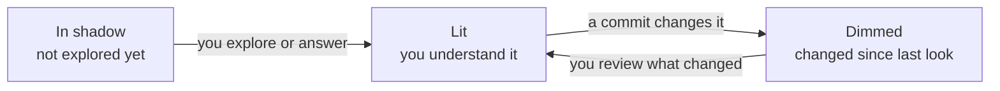

# Codiluce: code is fun again

Ideas for quizzes, mini-games and play in Codiluce, written 2026-10-09. Nothing here is built yet.

## Why play

Codiluce's index is already an answer key. Every flow, edge, dependent, snapshot and author is a fact backed by a
file and line. Quizzes and games can be generated without an LLM and checked automatically, and every answer can
show the line that proves it.

The risk is that "fun" reads as a gimmick to the engineering leads the site targets. Tie it to the agent-era problem
instead: agents write code faster than people understand it, and play is how you keep up. Fun is the hook;
understanding is the payoff.

## Signature mechanic: light the map

The core mechanic is "Bring your code to light" made literal: code you haven't explored sits in shadow, and it lights
up as you come to understand it. Your progress is how much of the map is lit.

- **What lights an area:** opening a file in the inspector, following a flow end to end, or answering a question
  about it.
- **What dims it again:** a commit that changes the area after you last looked, such as an agent rewriting a folder.
  The dimmed areas are a personal map of what you no longer understand. That makes it the most useful idea here, not
  just the most fun.
- **How it fits the product:** it's an overlay on the folder map, not a new layout, so it respects the one-map rule.
  Light is stored per person and kept local.
- **The reward:** a fully lit map plays a short eclipse animation of the E04 mark.

Dimmed areas are the ones to read again before you trust your picture of the code.

## Quizzes built from facts

Each quiz reads its answer from data Codiluce already indexes. Wrong options come from nearby files and flows, such as
the same folder or a similar size, so the questions aren't trivially easy.

| Quiz | Example question | Answer comes from |
|------|------------------|-------------------|
| Follow the flow | Put these steps in order: page, request, handler, table | Flow view (lanes and steps) |
| Blast radius | If you change `X`, which of these break? | Impact view (dependents by hop) |
| Odd one out | Three of these four files are in the same flow. Which one isn't? | Flows and the Features panel |
| Write or read | Which tables does `POST /orders` write? | Flows and data families |
| When did this appear? | Scrub the timeline to the commit that added this table | History snapshots and entity history |
| Who to ask | Who is the main person for `billing/`? | People panel (authorship) |

Who to ask is framed as finding the expert, never as a ranking. [Guardrails](#guardrails) explains why.

## Mini-games

Each game borrows a format people already know and scores it against the index, so no score depends on a guess.

| Game | Known format | How it plays | Scored by |
|------|--------------|--------------|-----------|
| CodeGuessr | GeoGuessr | You see a snippet, route or symbol name and drop a pin on the map | Distance in the folder tree from the real file |
| Code race | Wikirace | Get from symbol A to symbol B along real call and import edges | Your hops against the shortest path |
| Name the islands | Geography quizzes | The map's labels are hidden. Click the folder called `billing/`, or name the highlighted area | Correct clicks and names |
| Spot the difference | Spot the difference | Two snapshots side by side in the History Compare split map. Click every area that changed | Changed areas found, wrong clicks |
| Higher or lower | Higher or lower | Does this file have more dependents, churn or lines than that one? | Your streak |
| Gap hunt | Bug bounty | Findings Codiluce couldn't prove become puzzles. Supply the missing link | Each answer is saved as config and improves the map |

CodeGuessr is the best demo: it needs only the map and a symbol picker, and it makes a clear GIF. Name the islands
fits the archipelago metaphor. Gap hunt is the only game that also improves the index.

## Agent era: diff quiz before merge

The diff quiz asks three questions about what an agent just changed. If you can't answer them, you haven't reviewed
the change yet. This is how "fun" becomes a reason for teams to adopt Codiluce.

- **Where it runs:** `codiluce quiz --diff` in the terminal, or a button on the Impact view's "Uncommitted changes"
  origin.
- **What it asks:** questions drawn from the change's impact. For example: "This change adds a write to `invoices`
  from which flow?", "Which page now calls the new handler?" or "Which of these files depend on what changed?"
- **What it gives back:** each answer links to the evidence line. Wrong answers light up the parts of the map to read
  before merging.
- **What it isn't:** a merge gate. It stays opt-in and personal unless a team chooses to run it in CI.

## Social and spectacle

These ideas spread Codiluce beyond one person's screen. Two of them, the daily puzzle and Repo Wrapped, double as
marketing.

- **Daily puzzle in the terminal:** `codiluce daily` asks one question a day. A seed from the date and HEAD gives the
  whole team the same question. You share a Wordle-style emoji grid that shows no paths.
- **Team quiz night:** a Kahoot-style host mode on the local server, joined by teammates on the same network. Good for
  onboarding weeks.
- **Repo Wrapped:** a year-in-review card covering the biggest refactor, the oldest surviving line and the area that
  grew most, with the history time-lapse as a trailer. Run it on well-known open-source repos and post the results.
- **Ambient mode:** the camera slowly drifts along flows on an office TV.
- **Sound for the time-lapse:** each area is an instrument and each commit plays a note. A small, optional extra.

## Guardrails

Play must never turn Codiluce into a surveillance or grading tool. Four rules hold for every idea above:

- **No leaderboards built on people data.** Ranking authors by commits turns the People feature into surveillance.
  Scores stay personal and local, and team modes are opt-in.
- **Every answer links to its evidence.** A wrong answer then teaches you something instead of just costing points.
- **Deterministic first.** An LLM may phrase a question or explain an answer, but it never decides what the right
  answer is.
- **Never in the way.** No popups or nags. Play is something you open, not something that interrupts you.

## Where it lives and what to build first

Play gets a **Play** tab in the workbench, next to Map, Flow, Impact and Files, and a `codiluce quiz` command in the
CLI. That follows the workbench rule: new question-answering tools are middle tabs, and the map stays as the overview,
showing only what the front tool lights.

Recommended build order:

1. **Light the map, with fading.** It's the brand made literal, it's useful every day, and the other ideas build on
   it.
2. **CodeGuessr.** The best demo, and it needs only the map plus a symbol picker.
3. **Diff quiz.** It turns "fun" into a reason teams adopt the tool, and it builds on the Impact view's "Uncommitted
   changes" origin.

The quizzes and other mini-games can follow, once the question generator from steps 2 and 3 exists. Repo Wrapped can
ship at any point as a marketing piece.
